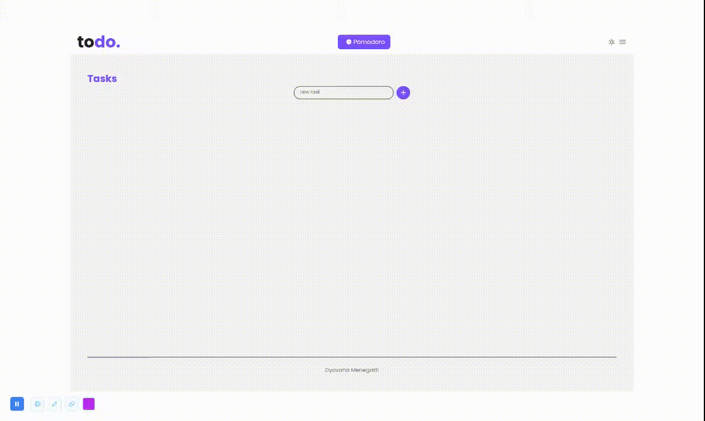

# PomoTask

## Overview
Task management application with integration of a Pomodoro timer.

## Features
- Add new tasks.
- View a list of all tasks.
- Favorite, edit, or delete a task.
- Filter tasks by favorites or completed.
- Responsive design for mobile and desktop views.

## Technologies Used
- Vue.js: JavaScript framework for building user interfaces.
- Vuex: State management library for Vue.js.
- Vue Router: Official router for Vue.js.
- LocalStorage: Browser storage for persisting data.
- Jest: Unit testing framework.

## Instalation
1. Clone the repository:
```
git clone <URL_DO_REPOSITORIO>
```
2. Install dependencies:
```
npm install
```
3. Run the development server:
```
npm run serve
```
4. Build for production:
```
npm run build
```
5. Run unit tests:
```
npm run test:unit
```

## Usage
- **Home Page**: A single interface displaying the task list, a button to open the Pomodoro timer modal, and the filter menu.
- **Light/Dark Mode**: Click the icon button in the navbar to toggle between light and dark modes.
- **Tasks**: Add new tasks, edit, delete, or favorite a task. Mark tasks as completed.
- **Pomodoro**: Play, pause, and reset the timer. Configure a new timer.
- **Filters**: Use the search input to filter tasks, view all favorite tasks, or view all completed tasks.
- **Unit Tests**: Ensures code quality.

## Demo



---

*Code by [Dyovana Menegatti](https://www.linkedin.com/in/dyomenegatti/).*
